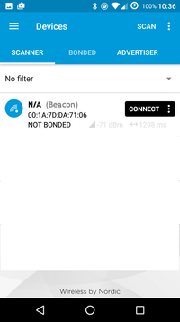
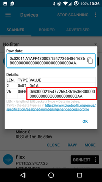

The picture of the chip shows it is a Bluetooth Low Energy device.

So, the idea is to scan packets in the air. This can be done with wireshark on a laptop, but for Bluetoot
h, Bluetooth Low Energy and NFC, a smartphone is more handy. We use a Bluetooth Low Energy scanner [nRF C
onnect](https://play.google.com/store/apps/details?id=no.nordicsemi.android.mcp&hl=en). See Figure 1.



We quickly have a look at all BLE devices there. One of them is a beacon. Beacons are typically used to send signals and have devices receiving the signal react accordingly. See for instance [Apple's iBeacon](https://en.wikipedia.org/wiki/IBeacon).
We inspect its details.


Let's have a look at the packet. The nRF Connect applications listens to Bluetooth Low Energy advertising  packets. What we see below is the advertising data content.



Advertising data can be structured in several chunks called "AD structures" (see [Bluetooth specification
s, Volume 3, Part C, 11](https://www.bluetooth.org/docman/handlers/downloaddoc.ashx?doc_id=229737)). 

- The first AD structure, type 1, holds advertising flags. This is of no interest for the challenge as 1 byte is too small to carry any useful information. 
- The second AD structure though, marked in red, is far more interesting. The type 0xff corresponds to "Manufacturer Specific Data". Such entries are used to carry whatever may be meaningful to the manufacturer
.

The content of this Manufacturer Specific Data is 43 00 02 15 47 48 31 36 7b 42 4c 45 2d 2d 72 75 6c 33 5
a 7d 00 00 00 00 AA.

Let's have a quick look at those bytes in a python interactive shell:

```python
In [2]: s = '43 00 02 15 47 48 31 36 7b 42 4c 45 2d 2d 72 75 6c 33 5a 7d 00 00 00 00 AA'
In [3]: s.replace(' ','').decode('hex')
Out [3]: 'C\x00\x02\x15GH16{BLE--rul3Z}\x00\x00\x00\x00\xaa'
```

Waow! There is a GH16{...} string in the middle, which looks like a flag. To be sure where the flag start s and ends, let's inspect the format more closely.

- Manufacturer Specific Data are expected to begin with a 2-byte company identifier. We have 43 00, i.e P
arrot. That's why we see a beacon manufactured by Parrot.
- Then, the next byte is always 02 for a beacon.
- Then, we have the length of the data: here, 0x15, ie 21 bytes follow.
- The rest of the manufacturer specific data is a UUID (16 bytes), Major (2 bytes), Minor (2 bytes) and T
X power (1 byte).

We see that our flag fits in the UUID. Major and minor are null. TX power is dummy (0xAA).
So, the flag is 
```
GH16{BLE--rul3Z}
```


